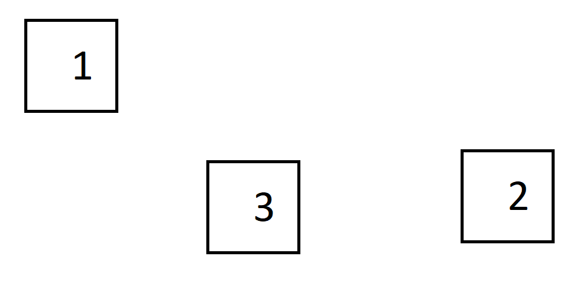

## PyAutoGui testing

The purpose of this program is to 
1. open MSPaint 
2. draw squares randomly on canvas 
3. count them by image recognition 
4. draw something on the canvas so the squares become unrecognizible 
5. try to count them again 
6. if count result is 0, close MSPaint. 

Change these global variables if you want to:

1. **squaresize**: change to an integer. Default is 150 (150*150 squares)
2. **input**: change to 1, 2 or 3 depending on what method to mess up the canvas you want to use. Method1:  Method2:  Method3: 
3. **notepad_enabled**: change to False if you don't want the program to write on Notepad. Default is True